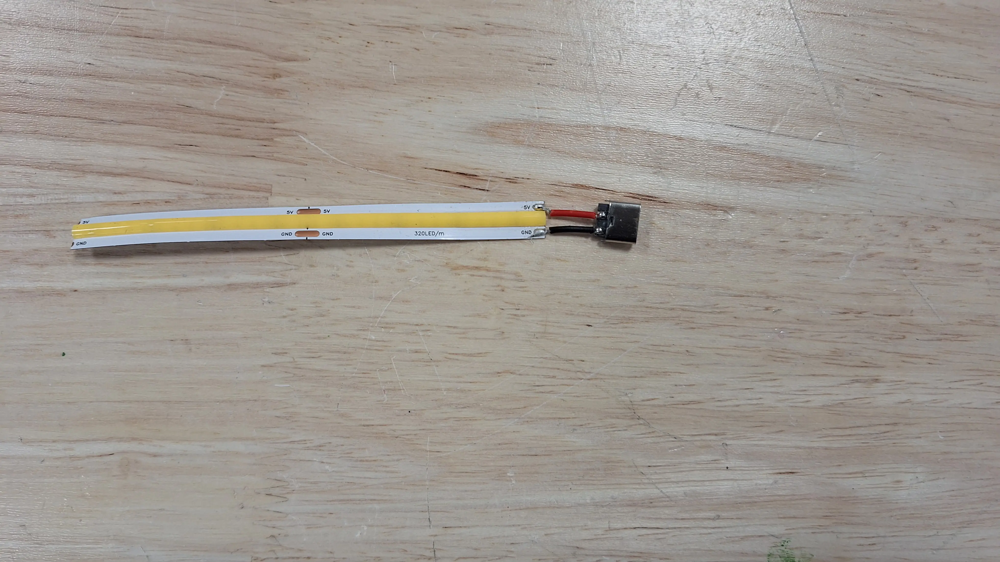
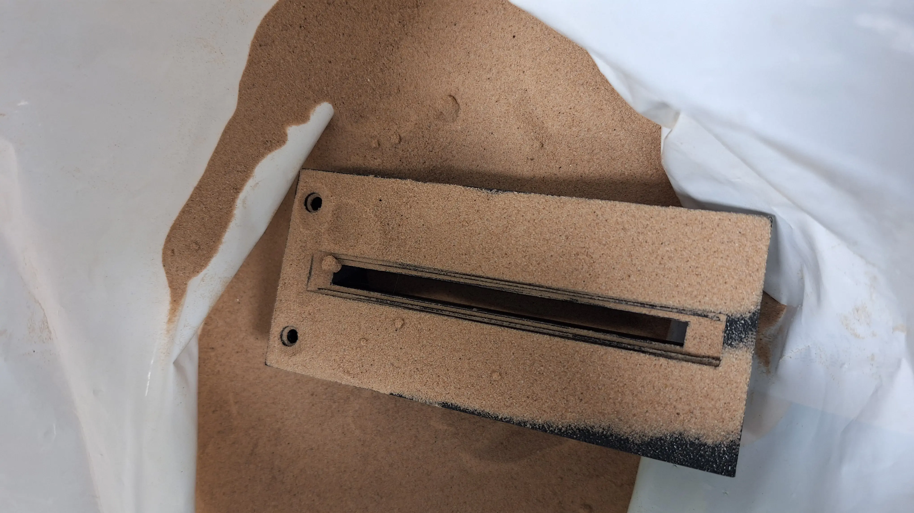
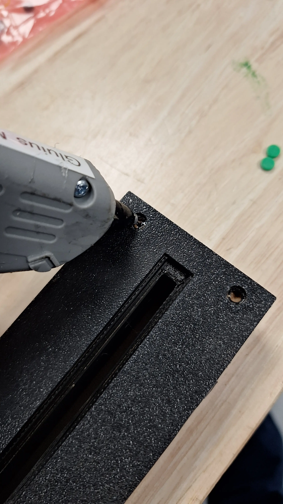
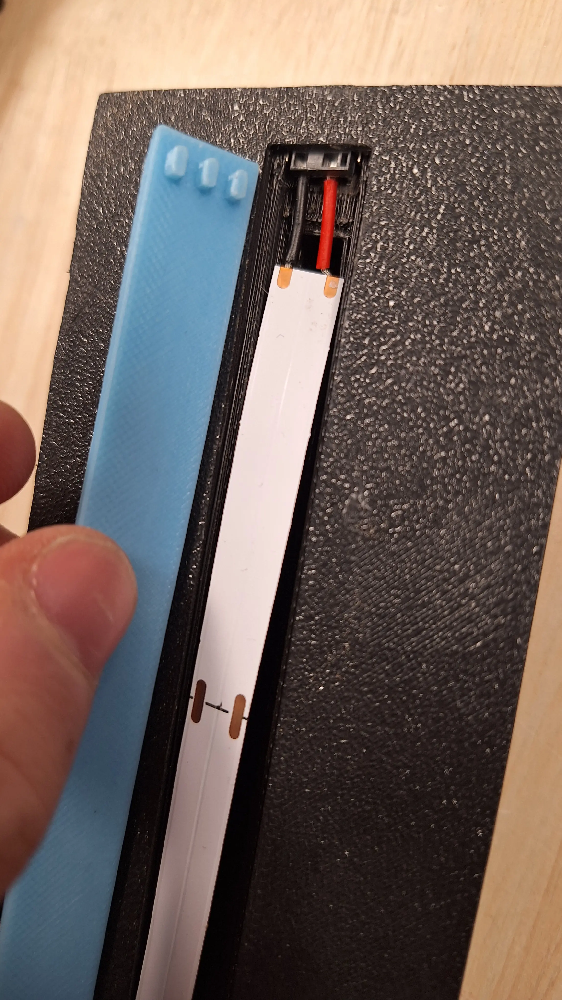

# Desk Plaque Workshop

<!-- TODO: Add Hero Image -->

| 🔨 Tools                            | 🪵 Materials              |
| ----------------------------------- | ------------------------- |
| Laser Cutter (eg OMTech 60W)        | 3mm Black Acrylic         |
| 3D Printer (eg Bambu p1p)           | 3mm Transparent Acrylic   |
| Hot Glue Gun                        | 3mm Laser Rubber          |
| Pliers                              | PLA Filament              |
| Vector Editing Software eg Inkscape | USB C Port                |
|                                     | Fine Sand                 |
|                                     | 120 LED/m Warm White LEDs |
|                                     | USB C Cable               |

## 📐 Making Parts

#### ⚡ Laser cutting:

1. Follow the instructions in `Name Plate.svg`
2. Remove the protective film from the acrylic
3. Cut out `Name Plate.svg` in the materials specified

#### 🖨️ 3D Printing:

Print all files in `3D files` folder

With the following settings:

- 0.2mm Layer Height
- 2 Perimeters
- Supports enabled and 0.2mm from part

- Infill doesn't matter

## 🛠️ Assembly

#### `Electronics:`

1. Cut the LED strip to fit in the hole in the base
2. Solder to USB C port

#### `Base:`

1. Remove Support from the 3D printed parts
2. Fill the holes of the base with sand
3. Hot the sand hole covers to the base to prevent sand from leaking

---

4. Add the LED strip to the base
5. Cover the LED strip with the 3D printed part and use it to hold the USB C port in place
6. Glue the rubber sheet to the bottom of the base to make it slide less and cover seams

#### `Acrylic:`

1. Remove the protective film from the acrylic
2. Put the transparent acrylic in with the text facing the inside (so the light catches it better)
3. use mallet to push it in
4. Then add the black acrylic and mallet it in
5. Plug it in and enjoy!

<!-- TODO: Add Image -->
