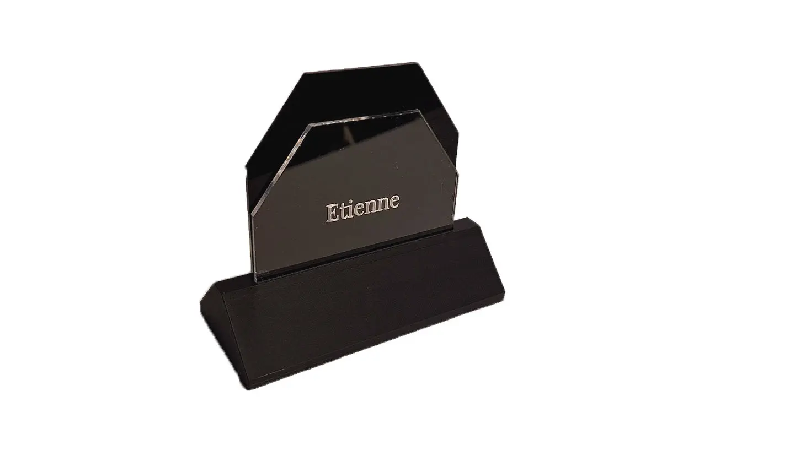
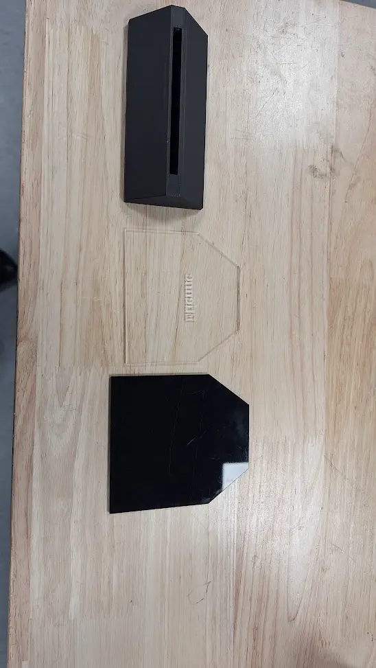
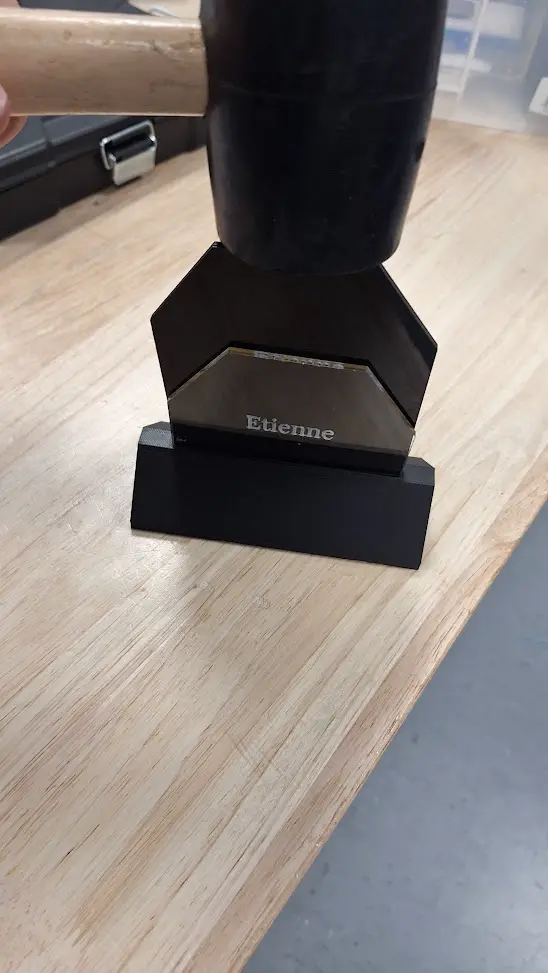

# Desk Plaque Workshop

 

This is a workshop to make a desk plaque with your name on it. This plaque is lit by LEDs underneath the acrylic nameplate. It is powered by a USB C port and was originally made in the ICRS Robotics lab.

 
 
 

| 🔨 Tools                             | 🪵 Materials              |
| -----------------------------------  | ------------------------- |
| Laser Cutter (eg OMTech 60W)         | 3mm Black Acrylic         |
| 3D Printer (eg Bambu p1p)            | 3mm Transparent Acrylic   |
| Hot Glue Gun                         | 3mm Laser Rubber          |
| Pliers                               | PLA Filament              |
| Vector Editing Software (eg Inkscape)| USB C Port                |
|                                      | Fine Sand                 |
|                                      | 120 LED/m Warm White LEDs |
|                                      | USB C Cable               |

## 📐 Making Parts

#### ⚡ Laser cutting:

1. Follow the instructions in `Name Plate.svg`
2. Remove the protective film from the acrylic
3. Cut out `Name Plate.svg` in the materials specified

#### 🖨️ 3D Printing:

Print all files in `3D files` folder

Use the following settings:

- 0.2mm Layer Height
- 2 Perimeters
- Supports enabled and 0.2mm from parts

Note that the infill percentage for this print doesn't matter.

## 🛠️ Assembly

#### `Electronics:`

1. Cut the LED strip to fit the hole in the base
2. Solder to USB C port

#### `Base:`

1. Remove Support from the 3D printed parts
2. Fill the holes of the base with sand
3. Use hot glue to seal the sand holes and add the covers to the base to prevent sand from leaking

---

4. Add the LED strip to the base
5. Cover the LED strip with the 3D printed part and use it to hold the USB C port in place
6. Glue the rubber sheet to the bottom of the base to make it slide less and cover seams

#### `Acrylic:`

1. Remove the protective film from the acrylic
2. Put the transparent acrylic in the slot of the base, with the text facing the inside for maximum contrast
3. Use mallet to gently push the acrlic plate into the slot
4. Then add the black acrylic and mallet it in
5. Plug the USB C port to a power source and enjoy!

### 📞 Contact

Course Designed for [Imperial College Robotics Society](https://linktr.ee/icrobotics)
By
- [Etienne Naude](https://etinaude.dev/contact/)
- [Anna Silver] (anna.silver22@imperial.ac.uk)
- Laura Shaw
- David Cai

